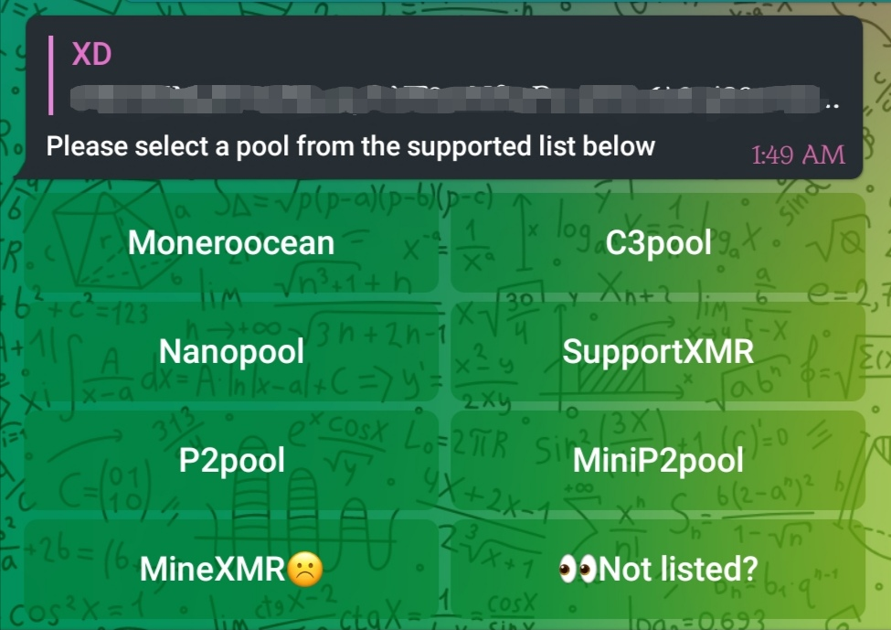
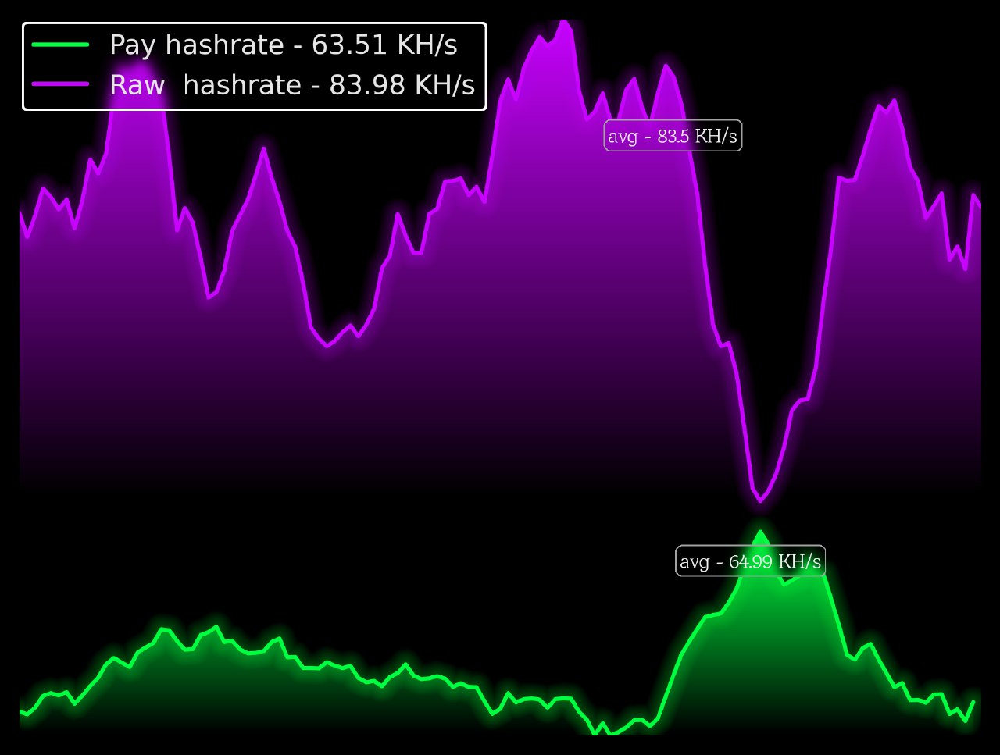
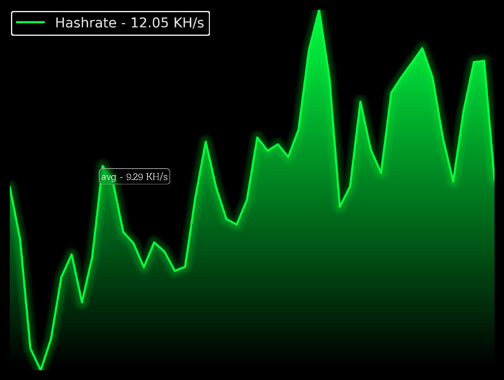
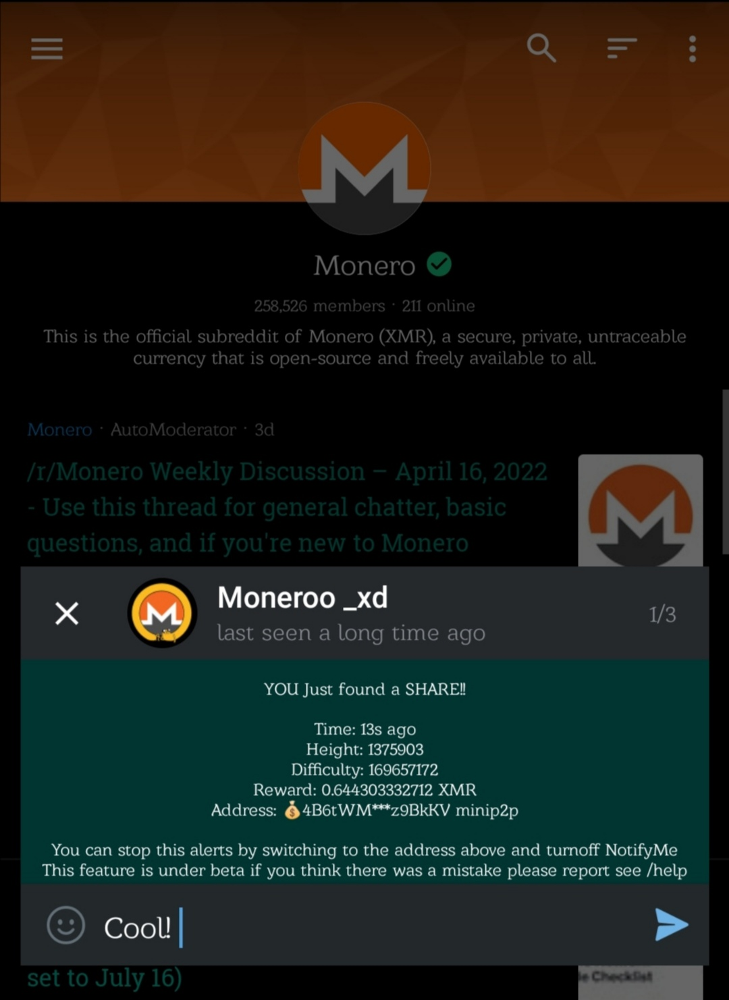
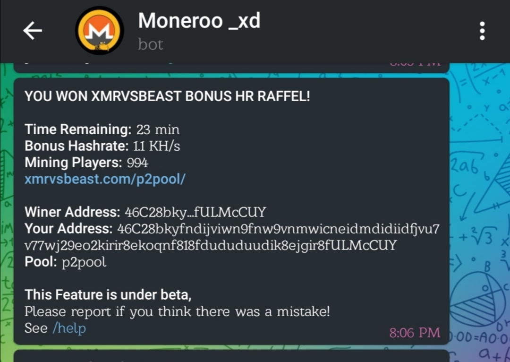

# Moneroo _XD

Code for the telegram bot [@Moneroo_XD_bot](https://t.me/Moneroo_XD_bot)

Features :] :
 - 7 xmr pools supported
 - 3 pools has graph support
 - 2 pools has share notifications push up
 - xmrvsbeast.com won notifications
 - minexmr has switch warning to advice ppl to switch
 - based on the pyrogram lib
 - Uses Multiple pools API
 - very low hardware/network usage
 - Supports Heroku/railway/local deploys
 - Completely safe no third-party libs used
   all data collected is safe (check requr.txt) 

enjoy :)

# Demo

https://user-images.githubusercontent.com/66136622/164122609-c30e36e6-5994-4e3b-a99e-5c27d4d527bd.mp4

https://user-images.githubusercontent.com/66136622/164122416-d3cabb76-ec57-47b2-b437-a6eee705a0e7.mp4

# Setup

### Redis
Whatever platform you choose to deploy to you will need a redis db,
this bot was designed for lightweight db query everything is cached locally to minimize db queries,
that said you can use the same db with different apps only four keys are used that need to be available, i actually use the same db for other things
You will need to add these four keys in your new db,

Key     | Value
--------|-----
usrwall | "{}" 
allwall | "{}" 
usrs    | "{}"
p2pusrs | "{}" 

usrwall  => current wallet address for all users
allwall  => all wallet addresses for all users 
usrs     => all users id
p2pusrs  => users subscribed to p2pool notifications

Bot will fail to start if one of these keys is missing from db
Add them using redis-cli or run the db-setup.py script

### Railway
it's easier to deploy on railway, it has free builtin redis db, 
and a deploy template everything is set up for you.
  - Click railway button
  - put your token/env in variables
  - enjoy!

### Heroku
you will need a redis db find one :)
  - click the heroku deploy button
  - make a new bot with bot father on telegram copy token
  - paste your token and other env, then deploy
  - enjoy!

### Local deploy
  - clone this repo
    `git clone https://github.com/Justxd22/moneroo_xd && cd moneroo_xd/`
  - install requirements with pip
    `pip install ./requirements.txt`
  - use online redis db or create one localy
    `apt install redis-server`
    it should be up and running on port 6379
    use 127.0.0.1:6379 as redisURI
    and leave the password empty
  - run db-setup.py to init keys for you
  - fill in stuff.py with your env
  - run moon.py
    `python3 moon.py`
  - enjoy!! :]

# Credits

[@pyrogram] (https://github.com/pyrogram/pyrogram) - telegram bot api

pm on telegram for any queries [@Pine_Orange](t.me/Pine_Orange) or [@xd2222](t.me/xd2222)

# Donation
You can support my work by donating to the following address,
THANKS KIND MINER!
  - XMR - `433CbZXrdTBQzESkZReqQp1TKmj7MfUBXbc8FkG1jpVTBFxY9MCk1RXPWSG6CnCbqW7eiMTEGFgbHXj3rx3PxZadPgFD3DX`
